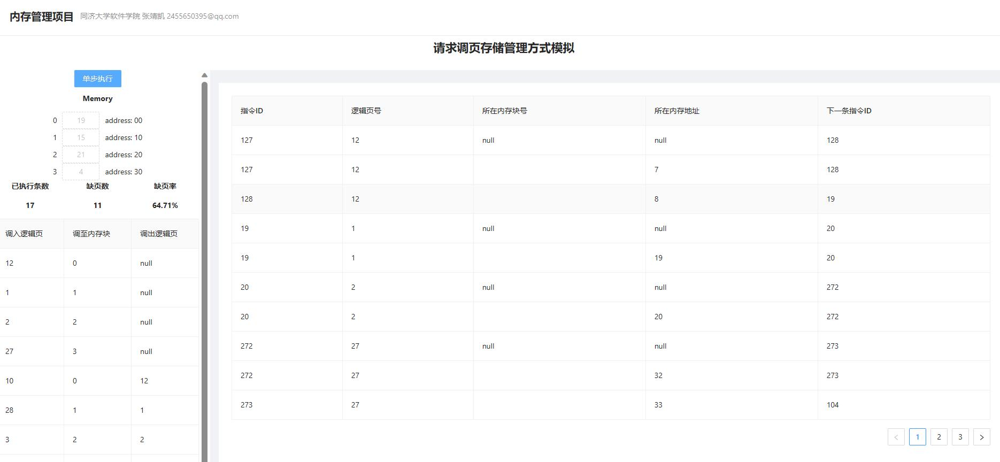

# 内存管理项目___请求调页存储管理方式模拟

作者：张靖凯

email：2455650395@qq.com

## 本地运行

在Chrome浏览器打开dist目录下的index.html

### 开发环境

开发语言：Javascript、html、css

开发框架：Vue.js 3.0 + Ant design Vue

### 项目结构

```
MemoryScheduling
├─ babel.config.js
├─ jsconfig.json
├─ package-lock.json
├─ package.json
├─ public
│    ├─ favicon.ico
│    └─ index.html
├─ src
│    ├─ App.vue
│    ├─ assets
│    │    └─ logo.png
│    ├─ components
│    │    └─ HomeView.vue
│    ├─ main.js
│    └─ scripts
│           └─ LRUCache.js
└─ vue.config.js
```

## 算法介绍

置换算法通过LRU算法实现，使用javascript实现LRU Cache。

LRU Cache（Least Recently Used Cache），它是一种缓存淘汰策略，当缓存满时，会淘汰最近最少使用的缓存项。

```javascript
class LRUCache {
    constructor(capacity) {
      this.capacity = capacity;
      this.cache = new Map();
      this.head = null;
      this.tail = null;
    }
    ...
}
```

这个类的构造函数接受一个整数 `capacity` 作为参数，表示这个缓存能够存储的最大数量。在构造函数中，它初始化了一个 `capacity` 属性，表示缓存的容量，一个 `Map` 对象来存储缓存项，一个 `head` 属性和一个 `tail` 属性来表示链表的头和尾。

这个类有三个方法：

`get(page)` 方法接受一个参数 `page`，表示要获取的缓存项的键。它首先检查缓存中是否有这个键，如果没有则返回 `-1`。如果有，它会获取缓存项的值，并将这个节点移动到链表的头部，表示这个节点是最近使用的节点。最后返回缓存项的值。

```js
    get(page) {
      if (!this.cache.has(page)) {
        return -1;
      }
      const node = this.cache.get(page);
      this.moveToHead(node);
      return node.value;
    }
```


`put(page, value)` 方法接受两个参数 `page` 和 `value`，表示要添加或修改的缓存项的键和值。如果这个缓存项已经存在，它会更新它的值，并将这个节点移动到链表的头部。如果这个缓存项不存在，它会创建一个新的节点，并将它添加到链表的头部。如果缓存已经满了，它会删除最近最少使用的缓存项（链表的尾部节点）。无论是添加还是更新缓存项，它都会将这个节点移动到链表的头部。

```javascript
 put(page, value) {
      if (this.cache.has(page)) {
        const node = this.cache.get(page);
        node.value = value;
        this.moveToHead(node);
      } else {
        const node = new Node(page, value);
        if (this.cache.size >= this.capacity) {
          this.removeTail();
        }
        if (!this.head) {
          this.head = node;
          this.tail = node;
        } else {
          node.next = this.head;
          this.head.prev = node;
          this.head = node;
        }
        this.cache.set(page, node);
      }
    }

```

`moveToHead(node)` 方法接受一个参数 `node`，表示要移动到链表头的节点。如果这个节点已经是链表头，那么什么也不做。如果这个节点是链表尾，那么它会将链表尾指向前一个节点，并将这个节点的 `next` 属性设置为 `null`。否则，它会将这个节点从链表中删除，并将它添加到链表头。

`removeTail()` 方法删除链表的尾部节点。如果链表为空，什么也不做。否则，它会从缓存中删除这个节点的键，并更新链表的尾部节点。如果链表只有一个节点，那么同时更新链表的头部和尾部为 `null`。否则，它会将链表尾指向前一个节点，并将这个节点的 `next` 属性设置为 `null`。

```js
  moveToHead(node) {
      if (node === this.head) {
        return;
      } else if (node === this.tail) {
        this.tail = node.prev;
        this.tail.next = null;
      } else {
        node.prev.next = node.next;
        node.next.prev = node.prev;
      }
      node.next = this.head;
      this.head.prev = node;
      node.prev = null;
      this.head = node;
    }

    removeTail() {
      if (!this.tail) {
        return;
      }
      this.cache.delete(this.tail.page);
      if (this.head === this.tail) {
        this.head = null;
        this.tail = null;
      } else {
        this.tail = this.tail.prev;
        this.tail.next = null;
      }
    }

```

这个类使用双向链表来维护缓存项的顺序，最近使用的节点放在链表头部，最近最少使用的节点放在链表尾部。当缓存满时，会删除链表尾部的节点。在访问缓存项时，会将这个节点移动到链表头部，以表示它是最近使用的节点。


### 数据结构

```js
let exeNum = ref(0);					///<已执行指令数
let pageMiss = ref(0);					///<缺页数
let lruCache = new linklist.linklist();	///<lru缓存

const memoryBlockNum = 4;				///<内存块数
const PageTableNum = 32; 				///<页表数
const instructionNum = 320;				///<指令总数
let memory = ref([]);					///<内存
let pageTable = ref([]); 				///<页表
let exeOrder = ref([]); 				///<指令执行顺序
let instructionRecord = ref([]);		///<指令记录，前端输出
```


### 代码实现

通过点击单步执行按钮实现每条指令的执行。

```js
const nextStep = () => {
    let instructionId = exeOrder.value[exeNum.value];
    let pageId = Math.floor(instructionId / 10);
    let page = pageTable.value[pageId];
    let singleRecord;
    // console.log(pageTable.value);
    if (page.valid == false) {
        instructionRecordUpdate(instructionId);
        pageMiss.value += 1;
        // lruCache.put(pageId, pageId);
        singleRecord = LRUToMemory(page);   //
        leftData.value.push(singleRecord);  // 
        pageTable.value[pageId].valid = true;
        pageTable.value[pageId].memoryId = singleRecord.block;
        instructionRecordUpdate(instructionId);
        if (singleRecord.pageOut != "null") {
            pageTable.value[singleRecord.pageOut].valid = false;
            pageTable.value[singleRecord.pageOut].memoryId = "null";
        }
    }
    else {
        lruCache.movetoHead(lruCache.findIndex(page.memory_id));
        instructionRecordUpdate(instructionId);
    }
    exeNum.value += 1;
}
```


### 项目运行




#### 页面UI说明

- 左栏：

  - 上部分为内存块信息，包含块序号、块内存放页的页号（若没有则为 null）、块起始地址（每次重置时随机给出）
  - 中间为当前已执行指令条数、当前缺页数、当前缺页率
  - 下部分为调页信息表，记录了目前为止每次调度的相关信息，包括调入的逻辑页、调至的块号、被替换出的逻辑页（若无则为 null）
  - 支持滚动条翻页翻阅所有信息
  - 单步执行按钮：点击后执行一条指令，若发生缺页则完成缺页请求调度后**再次打印本条指令信息**

- 右栏：

  - 记录每次指令执行的相关信息，包括指令id、指令位于的逻辑页号、包含指令的页当前在那一块内存块中（若不在内存中则为 null）、指令在内存中的地址（若不在内存中则为 null ），下一条指令的 id
  - 当指令不在内存中时，会**先显示指令缺页信息**，在缺页请求调度完成后，会**再次打印本条指令**调度后信息
  - 支持滚动条翻页翻阅所有信息

  

  
